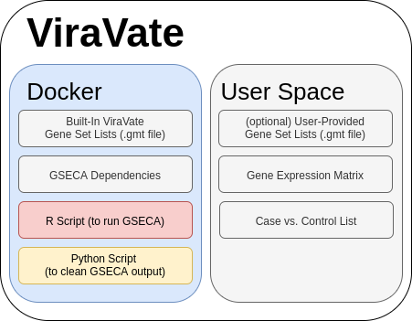
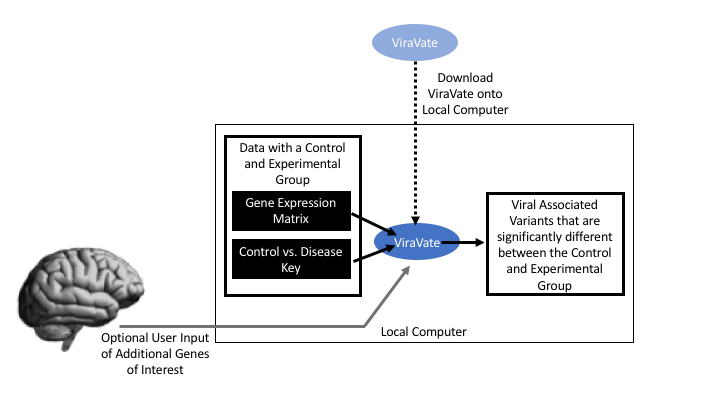
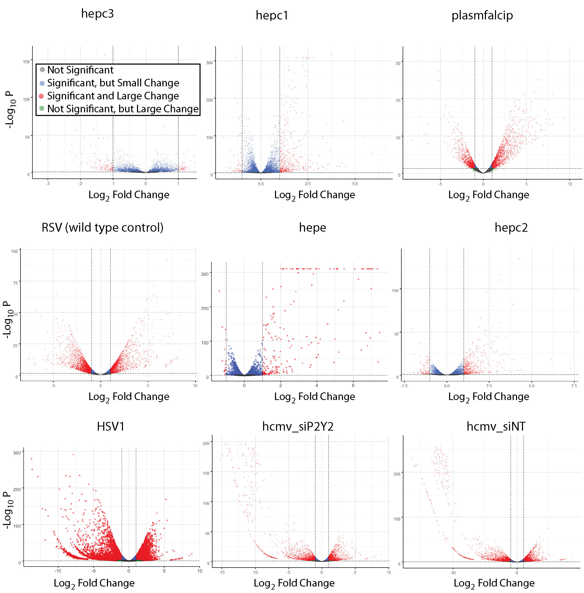
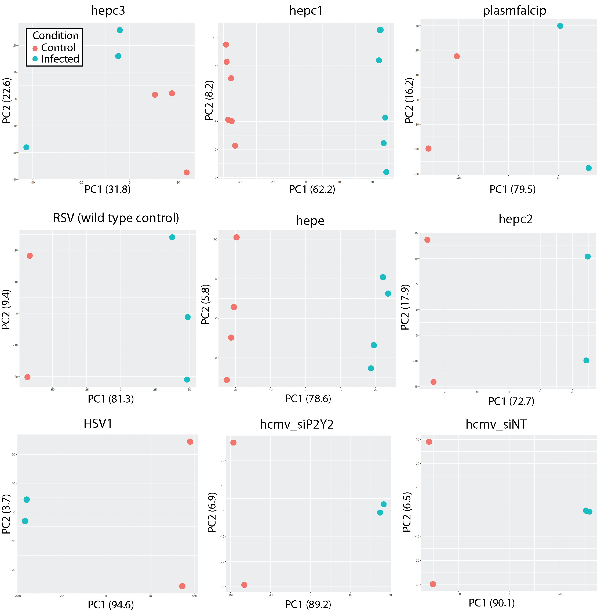
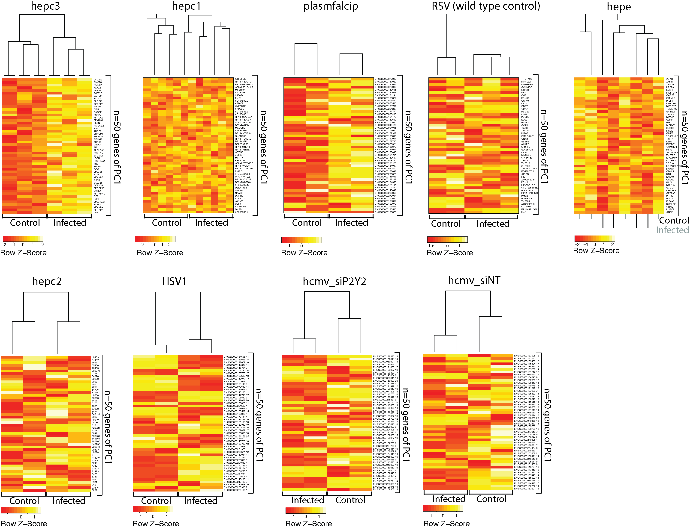

# ViraVate 
("vee-rah-vah-tey")
a.k.a. Virus Seer
 
# Why use ViraVate?

ViraVate is a command-line tool to identify whether differences between a user-provided gene expression matrix of any case vs. control (e.g. diabetics vs. non-diabetics) are associated with differentially expressed genes in infected vs. uninfected groups across a database of human-viral infections.

With ViraVate, you have a simple and fast solution to identify viral infection derived variants in data you already have. 

# How to set up ViraVate:



### Docker

ViraVate is powered with Docker. If you do not already have Docker installed, please install it with the [instructions here](https://docs.docker.com/install/).

### Installing ViraVate

1. Set up ViraVate Docker Container

Once you have Docker set up, run the following command:

```console
$ docker pull virushunter/base_viravate:latest
```

2. Clone the repository & navigate to the directory
<pre><code>git clone https://github.com/NCBI-Codeathons/Clinical-RNAseq.git
</code></pre>

3. Run viravate.sh within the "gseca" directory with the three arguments (gene_expression_matrix, case_control_list, additional_gene_sets). The following example shows how to run ViraVate with: <br/>

gene_expression_matrix = "small_m.tsv" <br/>
case_control_list = "small_l.tsv" <br/>
additional_gene_sets= "cereda.158.KEGG.gmt" <br/>

Note that all input files must be in the same directory as viravate.sh.

Also note that gene IDs should be converted to ensemble IDs prior to submitting your GEM to ViraVate.

```console
$ ./viravate.sh -e small_m.tsv -c small_l.tsv -g cereda.158.KEGG.gmt
```

### Configuration

# How to use ViraVate:



ViraVate requires as input files:

-  Gene expression matrix (".tsv", tab separated): matrix of normalized gene expression levels from RNA-seq experiments. Rows represent genes, columns represent samples and the corresponding expression levels. The first column must contain gene symbols, thus the first row must contain the label "symbol" followed by sample identifiers (e.g. barcodes, sample names). Please note that the gene symbols should be ensemble IDs. 
```
symbol             TCGA.YL.A8HL TCGA.EJ.5516 TCGA.KK.A8IC TCGA.EJ.7314 ...
ENSG00000000003        12.37        23.16        11.61        13.97    ...
ENSG00000000341         0.01         0.13         0.03         0.00    ...
ENSG00000000023        23.83        24.07        32.79        21.10    ...
ENSG00000000129         4.69         4.92         2.76         2.48    ...
ENSG00000000068         0.78         0.95         0.77         0.77    ...
...

```

-  Sample type labels (".tsv", tab separated): an ordered list of phenotype labels (CASE / CNTR), one per row matching the order of samples given in the gene expression matrix. NOTE: The first row must contain the label "X".

```
[1]
"x"
"CASE"
"CASE"
"CNTR"
"CNTR"
...

```

-  Additional Gene sets (".gmt" file): the list of gene sets to be tested. It can be predefined by the user, or selected from a collection of pre-processed gene sets of biological pathways and diseases included in the Shiny app.

```
"gene_set_A" "geneA" "geneB" "geneC" "geneD" ...
"gene_set_B" "geneE" "geneF" "geneB" "geneG"...
"gene_set_C" "geneA" "geneF" "geneH" "geneI" ...
...
 
```

This example is inspired by GSECA. [1]

# Sample Output

ViraVate outputs a tabular file containing the virus names, directionality p values (up or down in expression) and a logical significance value. 


# RNAseq Analysis

ViraVate represents an infrastructure that allows researchers to determine if control and experimental groups have different viral infection derived variants.  Having clear genetic variants of interest will facilitate longitudinal studies that can methodologically quantify the association between viral infection and future health complications.

Using 10 infections cases we have first visualized all genes with volcano plots. Note the unique distributions across the 10 infections. Some infections result in a large and significant change in magnitude of gene expression.



Performing a PCA analysis on the genes that had a large and significant change in magnitude.  The first two components of the PCA analysis visualized below.  Note that some infected and control groups are clearly separated, whereas other infected groups are not very different from the control groups. 



Heat maps of the top 50 genes from the first component of the  PCA analysis indicate that there are clear differences in gene expression between infected and controls for some (e.g., hep3, pasnfalcip) but not all infections. This could suggest that not all infections changes gene expression or that gene expression may only be changed in a subset of individuals. 



Raw counts from two hepatitis C infected studies were retrieved from NCBI GEO database and independently tested with edgeR. Significantly differentially expressed genes were intersected with genes associated with rheumatoid arthritis (from DisGenNET) and enriched with ShinyGO v0.61. 

https://www.disgenet.org/home/


# References

[1] Andrea Lauria, Serena Peirone, Marco Del Giudice, Francesca Priante, Prabhakar Rajan, Michele Caselle, Salvatore Oliviero, Matteo Cereda, Identification of altered biological processes in heterogeneous RNA-sequencing data by discretization of expression profiles, Nucleic Acids Research, , gkz1208, https://doi.org/10.1093/nar/gkz1208
